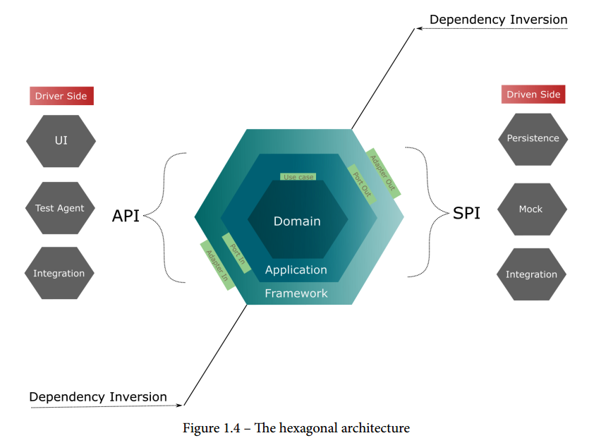
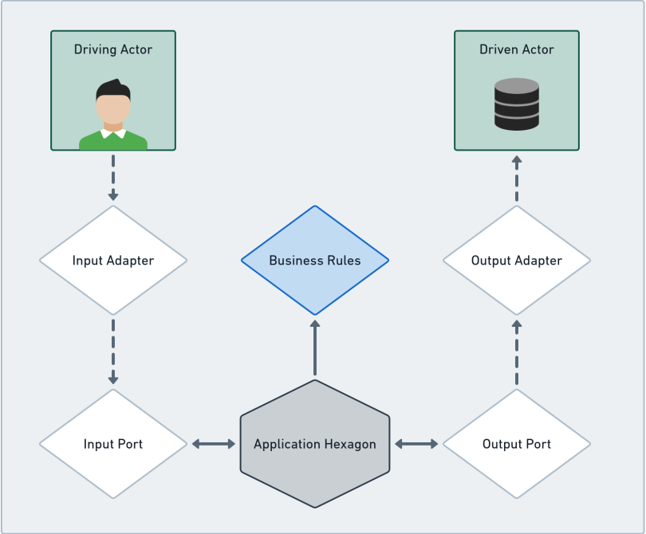

= Designing Hexagonal Architecture with Java, Quarkus and Apache Camel

== Links

- https://github.com/PacktPublishing/Designing-Hexagonal-Architecture-with-Java[
Designing Hexagonal Architecture with Java]

== Chapter One

. Software that is not well organized and lacks sound architecture principles may work fine but will present a high risk of developing technical debt, software need new feature to be added, this becomes more complex to maintain because there is no common ground to guide the addition or change of features.

=== What is Hexagonal Architecture?

. One of main ideas of hexagonal architecture is to separate business code from technology code, this give the rise of first hexagonal the *Domain hexagon*, process and orchestrate the business rules coming from the Domain hexagon that's bring us the *Application hexagon*, they're serving as a middleman to interact with both parties.
We have the *framework hexagon* provides the outside world interface, this is the place we have to opportunity to determine how to expose app features.

.Hexagonal Architecture

The *domain hexagon* represents an effort to understand and model a real-world problem

=== Entities

[source,java]
----
import java.util.function.Predicate;

record Router (RouterType routerType, RouterId routerId) {
  static Predicate<Router> filterRouter(RouterType routerType) {
    return routerType.equals(RouterType.CORE)? isCore(): isEdge();
  }

  static Predicate<Router> isCore() {
    return p -> p.getRouterType() == RouterType.CORE;
  }
}

enum RouterType {
  CORE, EDGE
}

class RouterId {
  long routeId;
}

----

.Ports and the Application hexagon
